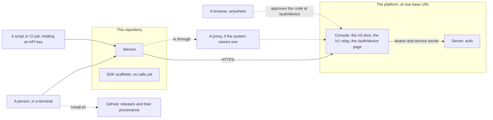
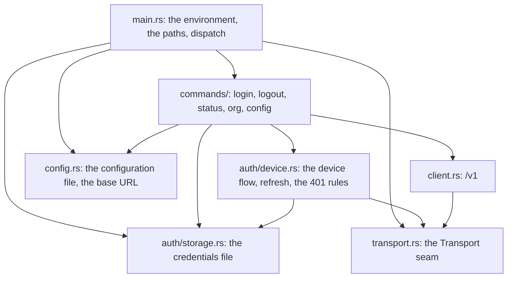

# Architecture

The Telmoni CLI and its SDKs on one page: what they are for, what they are made of, how a command reaches the platform, what they keep, how they fail, and why they are built this way. Start here. Each area has a page of its own (the [index](docs/README.md#pages)), and this page restates none of them: where a rule or a number lives on an area page, this page links to it rather than copy it.

The platform the CLI talks to has a design of its own, `ARCHITECTURE.md` in [`telmoni/telmoni`](https://github.com/telmoni/telmoni/blob/main/ARCHITECTURE.md), checked out beside this repo as `../telmoni/ARCHITECTURE.md`: its `/cli` door, `/me`, `/v1` and sessions. This page covers the client.

**Where it stands:** version 0.0.1, and no release has been cut, so `install.sh` has nothing to fetch yet and the CLI is built from source. It signs in and out, says who it is signed in as, and chooses an organization. Beyond its own session it changes nothing on the platform, except that `/cli/me` makes a first organization for a person who belongs to none, as a console sign-in does. The four SDKs are configuration only, and none is published.

## Contents

- [Purpose and scope](#purpose-and-scope)
- [Goals and constraints](#goals-and-constraints)
- [Context](#context)
- [Building blocks](#building-blocks)
- [Key flows](#key-flows)
- [Data](#data)
- [Security](#security)
- [Distribution](#distribution)
- [When something fails](#when-something-fails)
- [What comes next](#what-comes-next)
- [Decisions](#decisions)
- [Known gaps](#known-gaps)

## Purpose and scope

The CLI, `telmoni`, is how a person or a machine uses Telmoni from a terminal. Today it:
- signs a person in with a code approved in any browser, or a machine in with an API key;
- says who it is signed in as, and in which organization;
- lists the person's organizations, and chooses the one it acts in;
- keeps a configuration file: the endpoint to sign in against.

It is **one Rust binary**, a thin shell over a library the tests drive directly, and a **client of the platform and of nothing else**: nothing here runs on a server, holds a database or verifies a token. Beside it, `sdk/` holds the client SDKs for Rust, TypeScript, Go and Python: scaffolds that hold configuration and make no call until the platform serves the lanes they would call ([sdk](docs/sdk.md)).

| For | Read |
|---|---|
| Using the CLI | [telmoni.com/docs/api/cli](https://telmoni.com/docs/api/cli) |
| Using the SDKs | [telmoni.com/docs/api/sdks](https://telmoni.com/docs/api/sdks) |
| Developing it | `README.md`, `AGENTS.md`, and [Developing](https://telmoni.com/docs/contributing/developing#the-cli-and-sdks) |

## Goals and constraints

**What the design must hold:**

| Goal | How |
|---|---|
| **It talks to one platform, and to nothing else** | One base URL, `https://telmoni.com` unless `TELMONI_ENDPOINT` names another, and nothing in `src/` or `sdk/` calls another host; plain HTTP only to a loopback endpoint; no redirect followed ([transport](docs/transport.md#the-seam)) |
| **It works where no browser can reach it** | The device flow: the person approves a code in any browser, on any machine, and nothing listens here ([auth](docs/auth.md#the-device-flow)) |
| **A secret is never shown** | No token, refresh token, device code or API key in output or logs, and `Debug` written by hand on every struct that holds one ([transport](docs/transport.md#what-is-never-printed)) |
| **A crash or a blip never loses the session** | The credentials file written atomically; a 5xx or a dropped connection never deletes it; a refresh whose answer was lost asked again once ([auth](docs/auth.md#the-credentials-file), [auth](docs/auth.md#refresh)) |
| **The platform decides when a session ends** | A 401 read by its problem type, one refresh deciding a bearer refused as expired or unknown ([auth](docs/auth.md#when-the-session-has-ended)) |
| **What a checkout holds cannot redirect it** | The environment read only at the edge, a `.env` only in debug builds, and the configuration never from the working directory ([commands](docs/commands.md#the-environment-at-the-edge), [commands](docs/commands.md#the-configuration-file)) |
| **Tests never touch the network or the person's files** | HTTP, sleeps, the browser and both files' paths injected ([build](docs/build.md#tests)) |
| **A download can be checked** | A checksum beside every archive, and build provenance signed for the release workflow ([build](docs/build.md#release)) |

**What it is not, on purpose:**
- **A server, a database or a verifier.** The platform owns the session; the CLI holds its opaque tokens.
- **A loopback sign-in.** No listener, no redirect, no PKCE: a browser may never reach the machine.
- **Profiles.** One credentials file, one session at a time.
- **SDK clients written ahead of the platform.** A client waits for its lane in the platform's `V1_LANES`.

**What it must live with:**
- **Nothing has shipped.** Commands, flags and both files change in place, with no migration of an older file and no deprecated alias (`AGENTS.md`).
- **The platform's code is the contract.** A disagreement is recorded, and reported there, never worked around here ([auth](docs/auth.md#where-it-disagrees-with-the-platform)).
- **Two platforms are built:** Apple-silicon macOS and x86_64 Linux. On Intel macOS and ARM Linux, `install.sh` points to building from source, and it refuses any other platform ([build](docs/build.md#installsh)).

## Context

Who and what the CLI talks to.

| Party | What it is to the CLI | What crosses | Page |
|---|---|---|---|
| **A person** | Who signs in, at a terminal, over SSH or in a container | Commands; the user code and the URL on stdout | [commands](docs/commands.md#the-commands) |
| **A script or CI job** | Whoever holds an organization's API key | `login --key`, then `/v1` reads | [auth](docs/auth.md#api-keys) |
| **A browser, anywhere** | Where the person approves the code, on any machine | The console's `/auth/device` page; nothing reaches the CLI | [auth](docs/auth.md#the-device-flow) |
| **The platform's console** | The one host the CLI calls: the `/cli` door for a session, the `/v1` relay for a key | Every request, with the CLI's `User-Agent` and, when it acts in one, the organization's id | [transport](docs/transport.md#what-every-request-carries) |
| **The platform's server** | Behind the console, never called directly: it issues and ends sessions, and answers `/me` and `/v1` | Nothing directly | [the platform's identity page](https://github.com/telmoni/telmoni/blob/main/docs/identity.md#the-cli) |
| **A proxy** | Whatever the system's proxy variables name | Every request to another host, tunnelled through it and still encrypted; never one to this machine, which goes direct | [commands](docs/commands.md#the-environment-at-the-edge), [transport](docs/transport.md#the-seam) |
| **GitHub** | Where releases, their checksums and their provenance live | The archives, `SHA256SUMS`, `install.sh` | [build](docs/build.md#release) |

## Building blocks

The binary's modules, in `src/`, each arrow one building or calling another; the types they share are left out. The last three rows of the table stand beside the binary.

| Block | What it is | What it keeps | Page |
|---|---|---|---|
| `main.rs` | The only place that reads the environment: it resolves both files' paths, builds the transport, dispatches, and prints an error and exits 1 | — | [commands](docs/commands.md#startup) |
| `commands/` | One module per command, each handed its inputs as values | — | [commands](docs/commands.md#the-commands) |
| `auth/device.rs` | The device flow, refresh, and the reading of a 401 by its type | — | [auth](docs/auth.md) |
| `auth/storage.rs` | The credentials file, read leniently and written atomically | `credentials.json` | [auth](docs/auth.md#the-credentials-file) |
| `config.rs` | The configuration file, and where the base URL comes from | `config.json` | [commands](docs/commands.md#the-configuration-file) |
| `client.rs` | The one `/v1` call, under an API key | — | [transport](docs/transport.md#the-v1-client) |
| `transport.rs` | The seam every request goes through: TLS, deadlines, the plain-HTTP refusal, this machine past any proxy, the platform's error shapes | — | [transport](docs/transport.md) |
| `sdk/` | Four configuration-only scaffolds, one per language | — | [sdk](docs/sdk.md) |
| `xtask/` | The gate, `cargo xtask ci`, and packaging, `cargo xtask dist` | — | [build](docs/build.md) |
| `install.sh` | The installer: the machine's archive, a version, the checksum | — | [build](docs/build.md#installsh) |

## Key flows

### Signing in

`telmoni login` asks the `/cli` door for a device code, prints the user code and the URL, and opens a browser only on the endpoint's own origin. It polls at the interval the platform sets until the person approves or denies the code or it expires, then asks `/cli/me` who signed in, and saves the credentials file ([auth](docs/auth.md#the-device-flow)). `login --key` checks a key's shape and saves it, with no call ([auth](docs/auth.md#api-keys)).

### A command that acts in an organization

`status` and `org switch` refresh the access token when it expires within a minute, then ask `/cli/me` with the organization's id in `x-organization-id`, rewrite the cached person and organizations from the answer, and check that the platform acted in the organization they named. An organization is named by id or slug, resolved against the cache and sent as its id, and never by its label ([commands](docs/commands.md#organizations)).

### Signing out

`telmoni logout` refreshes if it must, then revokes the session row through the lane the console's Active sessions uses, falling back when the cached organization is one the person has left. It deletes the file whatever the answer, and says so when the platform did not confirm ([auth](docs/auth.md#signing-out)).

### When the platform says no

A failed answer is read in the platform's three error shapes, and a 401 by its problem type. A 401 typed `unauthenticated` ends the session; `token-expired` or `invalid-token` on a call gets one refresh, whose answer decides; any other 401, a 5xx or a dropped connection ends nothing ([transport](docs/transport.md#errors), [auth](docs/auth.md#when-the-session-has-ended)).

## Data

The CLI's only state is two files in the person's configuration directory, `~/Library/Application Support/telmoni/` on macOS and `~/.config/telmoni/` on Linux, and never in the working directory.

| File | Holds | Written | Page |
|---|---|---|---|
| `credentials.json` | The endpoint fixed at sign-in; for the device flow the access and refresh tokens, the access token's expiry, the session row's id, the person, the cached organizations and the active one; or an API key | At sign-in, after every refresh, and by `status` and `org switch`: atomically, mode `0600`, not encrypted | [auth](docs/auth.md#the-credentials-file) |
| `config.json` | The endpoint to sign in against, and an output format no command reads yet | By `config set`, a plain write: it holds no secret | [commands](docs/commands.md#the-configuration-file) |

A file that cannot be read or parsed reads as signed out, or as the default configuration, with a note that never quotes it, and a missing one silently. The `config` commands alone fail on a `config.json` that does not parse.

## Security

- **One host.** Every request goes to the base URL, a redirect is answered as an error so a bearer never follows one, and the browser opens only on the endpoint's own origin ([transport](docs/transport.md#the-seam), [auth](docs/auth.md#the-device-flow)).
- **TLS to every endpoint but a loopback one.** rustls with bundled web PKI roots, the same on every host; plain HTTP is refused before anything is sent unless the host is a loopback one, and a request to this machine never goes through a proxy ([transport](docs/transport.md#the-seam)).
- **Every request has a deadline**, set past the console's own wait on the server, so a stalled host fails in seconds ([transport](docs/transport.md#the-seam)).
- **No secret is printed.** No token, refresh token, device code or API key reaches stdout, stderr or `-v`'s log, and a credentials file that does not parse is logged under `-v` by line and column, never by its contents ([transport](docs/transport.md#what-is-never-printed)).
- **A checkout cannot steer a released binary.** A `.env` is read in debug builds only, and neither file is ever read from the working directory ([commands](docs/commands.md#the-environment-at-the-edge)).
- **The supply chain is checked.** `--locked` on every gate step that resolves dependencies, `cargo deny` on every run and daily, `unsafe` forbidden, and every release's archives and installer attested for the release workflow ([build](docs/build.md#lints-and-policy), [build](docs/build.md#release)).

## Distribution

- **The gate** is `cargo xtask ci`, the same locally and in CI, run in CI on both shipped platforms ([build](docs/build.md#the-gate)).
- **A release** is an annotated `v*` tag matching the workspace's version: each platform built natively, the archives and `install.sh` attested, and a GitHub release made from the tag ([build](docs/build.md#release)).
- **`install.sh`** picks the archive for the machine, checks it against `SHA256SUMS`, and installs it. The checksum catches a corrupted download; the provenance, which `gh attestation verify` checks, catches a swapped one ([build](docs/build.md#installsh)).
- **The SDKs are not released.** The Rust crate takes the workspace's version, TypeScript and Python carry their own, and Go will need tags of its own, `sdk/go/v…` ([sdk](docs/sdk.md#versions-and-publishing)).

## When something fails

| Fails | What a person sees | What recovers it |
|---|---|---|
| **The platform, or the network** | The platform's message or, when nothing answered, the URL and the cause; the session kept | The platform |
| **A refresh whose answer is lost** | Nothing: it is asked again once, within the platform's grace | — |
| **A slow or stalled host** | A timeout in seconds, never a hang | The host |
| **The session, ended in the console** | "session ended; run `telmoni login`", and the file deleted | `telmoni login` |
| **A 401 of another type** | Its message; the session kept | The platform |
| **A clock that runs slow** | Nothing: the refresh after the fact covers what the early one missed | — |
| **A crash mid-write** | The previous credentials file, whole | — |
| **A file that does not parse** | Signed out, or the default configuration, with a note; the `config` commands fail on it | `telmoni login` for the credentials; mending or deleting `config.json` |
| **No configuration directory** | The command says so and exits 1 | The environment |
| **A browser that cannot open** | A note; the code and the URL are printed already | Any browser |
| **An organization's URL changed** | The new slug refused until the cache is rewritten; the old one held to the platform's answer by `status` and `org switch` | `telmoni status` |

## What comes next

- **The SDKs grow clients together**, once the platform serves the lanes they would call, on the CLI's transport rules: one base URL, a `User-Agent` naming the SDK, the platform's error shapes, no credential in any output ([sdk](docs/sdk.md#growing-a-client)).
- **A command that touches customer data** comes after its lane in the platform: `/cli` for a signed-in person, `/v1` for an API key (`AGENTS.md`).
- **The platform plans a host for machines**, apart from its console, and the console's `/v1` and `/cli` relays go with it ([the platform's design](https://github.com/telmoni/telmoni/blob/main/ARCHITECTURE.md#where-it-goes-next)). Those are the lanes the CLI calls.

## Decisions

| Decision | Why | What it gives up | Page |
|---|---|---|---|
| **The device flow, not a loopback redirect** | The CLI runs over SSH, in containers and on hosts with no browser | The person types a code | [auth](docs/auth.md#the-device-flow) |
| **One base URL, through the console's doors** | One address to configure, and the CLI never needs the server's | Every request takes the console's hop | [transport](docs/transport.md) |
| **The platform's opaque tokens, the platform deciding** | No token is verified here, so nothing here can be wrong about one | A request to learn whether a session lives | [auth](docs/auth.md) |
| **A 401 read by its type, one refresh deciding** | A blip, a botched secret rotation or a proxy cannot sign every CLI out | The rules follow the platform's problem types, held in step by hand | [auth](docs/auth.md#when-the-session-has-ended) |
| **One retry of a refresh with no answer** | The platform rotates the refresh token on use, and a spent one presented late ends the session | A second request when the first answer was lost | [auth](docs/auth.md#refresh) |
| **The credentials file: `0600`, unencrypted, written atomically** | It runs over SSH, in containers and on CI runners, so it keeps no state beyond this one file, and a crash leaves the previous file whole | Whoever can read the person's files can read the tokens | [auth](docs/auth.md#the-credentials-file) |
| **The environment at the edge, a `.env` in debug builds only** | A released binary run in somebody else's checkout cannot take its endpoint or key | A `.env` does nothing for a released binary | [commands](docs/commands.md#the-environment-at-the-edge) |
| **Organizations by id or slug, never by label** | A label is neither unique nor stable, and a wrong guess acts in another organization | People type a slug, not a name | [commands](docs/commands.md#organizations) |
| **No redirect followed, and plain HTTP only to a loopback endpoint** | A bearer must neither follow a redirect nor cross a network in the clear | A platform behind a redirect, or plain HTTP to another host, does not work | [transport](docs/transport.md#the-seam) |
| **This machine past any proxy** | A proxy would carry plain HTTP to this machine off it in the clear, and a remote one cannot reach its ports | A proxy set up to watch local traffic sees none of the CLI's | [transport](docs/transport.md#the-seam) |
| **rustls with bundled roots** | The same trust on every machine | A root added to the system's store is not trusted | [transport](docs/transport.md#the-seam) |
| **`Debug` written by hand wherever a secret lives** | A log line or a failing test prints no token, and a field added later must be placed | Each such struct carries its own `Debug` | [transport](docs/transport.md#what-is-never-printed) |
| **SDKs configuration-only, growing together** | A client ahead of its contract freezes a guess, and a language that lags is a customer who cannot start | No SDK call works today | [sdk](docs/sdk.md) |
| **One gate, locally and in CI** | CI's Rust job is this same command, on both shipped platforms | The SDKs' checks and the workflow lint are CI jobs beside it, outside the gate | [build](docs/build.md#the-gate) |
| **Native builds, and provenance instead of a key** | Each archive is built on the platform it runs on, where CI's gate passed, and no signing key is kept anywhere: the certificate is minted per run | Two platforms; checking provenance needs `gh` | [build](docs/build.md#release) |

## Known gaps

The ones that shape the design, each kept on its page until it is closed:
- **Two CLI processes writing at once** are not locked against each other: the last rename wins ([auth](docs/auth.md#the-credentials-file)).
- **Signing in again** leaves the earlier session live, under Active sessions, until it ends there ([auth](docs/auth.md#the-device-flow)).
- **`install.sh` checks the checksum, not the provenance**, since checking it needs `gh` ([build](docs/build.md#installsh)).
- **`slow_down` grows the interval for good**, where the platform holds a poll to the interval it started with; harmless ([auth](docs/auth.md#where-it-disagrees-with-the-platform)).
- **Some numbers are unnamed literals:** the 60-second refresh skew, the 5-second `slow_down` step and the 1-second interval floor ([docs](docs/README.md#keeping-these-pages-true)).
- **Untested:** the real transport's deadlines and connection failures, the direct client's lack of a proxy, the browser opening, and a signed-in run of the binary ([build](docs/build.md#tests)).
- **The SDKs differ at the edges**, over an empty endpoint passed explicitly ([sdk](docs/sdk.md#defaults-and-the-environment)); Go's example never runs, and TypeScript's tests import the sources rather than the built package ([sdk](docs/sdk.md#what-the-tests-pin)).
- **`output_format` is accepted and stored**, and no command reads it ([commands](docs/commands.md#the-configuration-file)).
