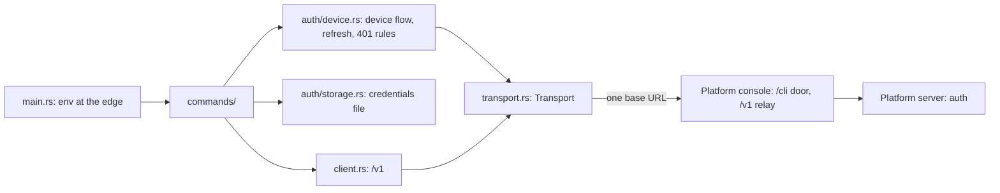

# Architecture

How the Telmoni CLI and its SDK scaffolds are built, and why. These pages are for people and agents changing this repo. How to use the CLI is in [`telmoni/docs`](https://github.com/telmoni/docs) (`api/cli.mdx`, `api/sdks.mdx`) and this repo's README.

The CLI is a **client of the platform and of nothing else**:
- nothing here runs on a server, holds a database or verifies a token;
- every request goes to one base URL;
- the platform's code is the contract.

How the platform is built is in [`telmoni/telmoni`](https://github.com/telmoni/telmoni)'s `architecture/`, checked out as `../telmoni/architecture/`.

## Pages

| Page | Covers |
|---|---|
| [commands.md](commands.md) | Startup, the environment at the edge, the configuration file, each command, organizations, output |
| [auth.md](auth.md) | The device flow, the credentials file, refresh, when a session has ended, signing out, API keys, where the CLI and the platform disagree |
| [transport.md](transport.md) | The HTTP seam, what every request carries, error shapes, the `/v1` client, what is never printed |
| [sdk.md](sdk.md) | The four SDK scaffolds, why they hold configuration only, their tests, how one grows a client |
| [build.md](build.md) | The gate (`cargo xtask ci`), tests, lints and policy, packaging, `install.sh`, release, CI |

## The shape



## Rules that hold everywhere

1. **One base URL.** `https://telmoni.com`, unless `TELMONI_ENDPOINT` says otherwise. No other hostname appears in `src/` or `sdk/`. Plain HTTP reaches only this machine. ([transport](transport.md))
2. **The platform's code is the contract.** Read the `/cli` door, `/me` and `/v1` in `telmoni/telmoni` before touching `src/auth/` or `src/client.rs`. Report a disagreement there rather than working around it here. ([auth](auth.md#where-it-disagrees-with-the-platform))
3. **Stateless machines.** The CLI runs over SSH, in containers, on CI runners and on hosts with no browser. Nothing may depend on a browser reaching the machine, a listening port, or state beyond the credentials file. That is why sign-in is the device flow. ([auth](auth.md#the-device-flow))
4. **The environment is read only at the edge.** `main.rs` reads it and passes values down. A `.env` is read in debug builds only. ([commands](commands.md#the-environment-at-the-edge))
5. **Tests are hermetic.** HTTP, sleeps and the poll loop's clock are injected, and the credentials path is a value. No test touches the network or the person's real files. ([build](build.md#tests))
6. **stdout is the command's output; everything else goes to stderr.** ([commands](commands.md#output))
7. **Nothing secret is ever printed:** no token, refresh token, device code or API key. The user code is the only code shown. ([transport](transport.md#what-is-never-printed))
8. **A 5xx never deletes the credentials file, and a 401 ends the session only as its problem type says.** One refresh decides a bearer refused as expired or unknown; a 401 the console answers for its own failure ends nothing. ([auth](auth.md#when-the-session-has-ended))
9. **The SDKs stay configuration-only until their contract exists.** ([sdk](sdk.md))

## Map of the code

```text
src/
  main.rs           the only environment reads; parse, dispatch, print the error, exit 1
  lib.rs            the library the binary and the tests share
  commands/         login, logout, status/whoami, org, config
  auth/device.rs    the device flow, refresh, the 401 rules
  auth/storage.rs   the credentials file, written atomically
  client.rs         the /v1 client (API keys)
  config.rs         the configuration file and the base URL
  transport.rs      the Transport seam, User-Agent, error shapes
tests/auth_tests.rs the library's suite, against a mock transport
tests/cli_tests.rs  the built binary, in a home and working directory of its own
sdk/                rust/, typescript/, go/, python/: configuration-only scaffolds
xtask/              cargo xtask ci (the gate), cargo xtask dist (packaging)
install.sh          the installer, checksum-verified
.github/workflows/  ci.yml, release.yml, audit.yml
```

## Glossary

| Term | Meaning |
|---|---|
| **The `/cli` door** | The platform console's route for the CLI (`web/app/cli/[...path]/route.ts`). It forwards an allowlist of lanes to the platform's server, refuses browsers, and meters callers. |
| **Lane** | One of the platform's endpoints, such as `/cli/me` or `/cli/auth/refresh` |
| **Device code** | The secret the CLI polls with. Never printed. |
| **User code** | The short code the person types into the console to approve a sign-in. The only code shown. |
| **Session row** | The platform's record of a sign-in, listed under Active sessions on the person's Privacy page. `sessionRowId` is how the CLI refreshes and revokes it. |
| **Active organization** | The CLI's chosen organization, sent as `x-organization-id`. The platform itself picks one per request. |
| **Slug** | The name an organization goes by in the console's URL. A placeholder (`org-` and ten random characters) until the first name its owner gives it reads as a slug and replaces it; after that only a change to its URL setting moves it, never a rename. The CLI takes one wherever it takes an id, and sends the id. |
| **Credentials file** | `credentials.json` in the configuration directory, mode `0600`, unencrypted: the CLI's only state |

## Keeping these pages true

- **A change that alters what a page says updates that page in the same change.** The pages follow the code's layout.
- **A change a user can see** also names the customer pages it leaves wrong (`api/cli.mdx`, `api/sdks.mdx` in `telmoni/docs`).
- **Name the constant, don't copy the value**, where the code names it. Some of the CLI's numbers are unnamed literals today: the 60-second refresh skew, the 5-second `slow_down` step, the 1-second interval floor. Pages describe them in words.
- **Say why.** Write down what broke, or what would break.
- **A disagreement with the platform is recorded in [auth](auth.md#where-it-disagrees-with-the-platform)** until one side changes.
