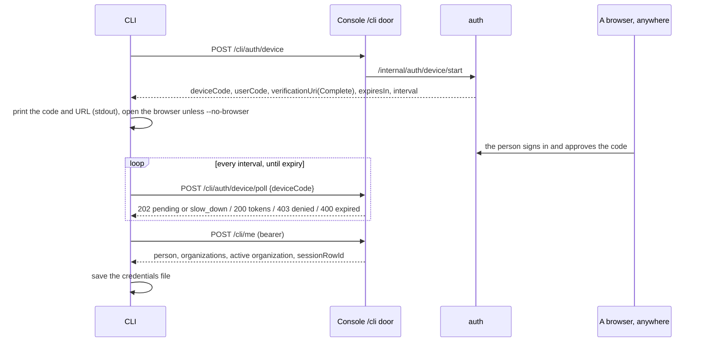

# Signing in

The CLI signs in two ways:
- **The device flow, interactive.** It runs through the platform's `/cli` door: the person approves a short code in any browser, on any machine.
- **An API key, for automation.** The key opens only the public `/v1` API.

Either way, what the CLI keeps is one credentials file. The platform owns the session: the CLI holds the platform's opaque tokens, and the platform decides whether they still work.

The platform's code is the contract (AGENTS.md):
- the `/cli` door, `web/app/cli/[...path]/route.ts`;
- `/me`, `crates/auth/src/handler/me.rs`;
- the device grant, `crates/auth/src/issuer.rs` and `crates/auth/src/handler/session.rs`;
- `/v1`, `crates/auth/src/handler/v1.rs`.

The platform's own side is in `telmoni/telmoni`'s `architecture/identity.md`. A disagreement is reported there, not worked around here.

## Contents

- [The device flow](#the-device-flow)
- [The credentials file](#the-credentials-file)
- [Refresh](#refresh)
- [When the session has ended](#when-the-session-has-ended)
- [Signing out](#signing-out)
- [API keys](#api-keys)
- [Where it disagrees with the platform](#where-it-disagrees-with-the-platform)
- [Where it lives](#where-it-lives)

## The device flow

1. **Start.** `POST /cli/auth/device`, with no bearer and no body (`src/auth/device.rs`). The platform answers:
   - a device code, kept secret and never printed;
   - a short user code, shown as `XXXX-XXXX`;
   - the console's `/auth/device` page, as a plain URL and as one carrying the code;
   - the code's lifetime and the polling interval.
2. **Show it.** The user code and the plain URL go to stdout. The CLI tries to open the URL carrying the code in a browser, unless `--no-browser` is given. A failure there is a note on stderr, never an error.
   - ⚠ **Nothing depends on the browser reaching this machine.** The CLI runs over SSH, in containers and on hosts with no browser. That is why it uses the device flow and not a loopback redirect. There is no listener and no PKCE (AGENTS.md).
3. **Poll** (`poll_until_granted`). Each round sleeps first, then checks the code's lifetime on the local clock, then polls:

   | The platform answers | The CLI |
   |---|---|
   | 202, pending | Waits another interval |
   | 202, `slow_down` | Adds 5 s to the interval, for the rest of this login |
   | 429 | Waits the problem's `retry_after_secs` once, then carries on |
   | 200 | Has its tokens |
   | 403 | Stops: the sign-in was denied in the console |
   | 400 | Stops: the code expired before it was approved |
   | 401 | Stops: the device code is no longer valid |
   | 5xx, or a network failure | Stops. The person runs `telmoni login` again. |

   The interval never drops below one second.
4. **Who am I.** `POST /cli/me` with the new bearer. The door sends `/me` the CLI's `User-Agent`, so the session appears on the person's Sessions page as "Telmoni CLI (macOS)" or similar. `/me` writes the session row, and answers its id (`sessionRowId`), which later sign-outs need.
5. **Save** the credentials file, then print who signed in and their active organization.

Signing in again overwrites the file without revoking the earlier session, which stays on the Sessions page until it ends there.

## The credentials file

`dirs::config_dir()/telmoni/credentials.json`: `~/Library/Application Support/telmoni/` on macOS, `~/.config/telmoni/` on Linux. It is mode `0600` and **not encrypted**. It is plain JSON (`src/auth/storage.rs`), holding:
- `auth_type`: `device` or `api_key`;
- `endpoint`: the base URL, fixed at sign-in;
- for the device flow: the access and refresh tokens, `expires_at` (on the local clock), `session_row_id`, the person, the cached organizations (id, slug, label, role), and the active organization's id;
- for an API key: the key;
- `updated_at`.

**Reading it.** A missing file reads as signed out, silently. A file that is there but cannot be read or parsed also reads as signed out, with a note on stderr saying to sign in again; so does one missing what its kind needs (a device sign-in with no token, an API key sign-in with no key). Nothing else is said of the file: no "corrupt", and never its contents. There is no migration of an older shape (AGENTS.md): a file written before a field became required, such as `slug`, is one of these, and `logout` deletes it without a revoke, since nothing in it can be used.

**Writing it is atomic** (`save`):
1. Write to a sibling temporary file, opened `create_new` with mode `0600`.
2. Flush it to disk.
3. Rename it over the old file.
4. Flush the directory, because a rename is durable only once its directory entry is.

⚠ Why it is built this way:
- **Tokens never sit in a readable file**, even for a moment.
- **A crash leaves the previous file whole**, never a torn one that reads as signed out.
- **The rename replaces any looser mode** an older file had.

Directories get `0700` only when the CLI creates them; an existing directory is not this code's to tighten. There is no lock between two CLI processes writing at once; the last rename wins.

**When it is written:**
- at sign-in;
- after every refresh;
- by `status`, which refreshes the cached person and organizations;
- by `org switch`.

## Refresh

The access token is short-lived. The CLI refreshes:
- **ahead of time**, before `status` and `org switch`, when the token expires within 60 seconds or its expiry is unknown (`refresh_if_needed`);
- **after the fact**, once, when `/cli/me` answers a 401 of type `/errors/auth/token-expired`. It refreshes and retries the call once.

The request is `POST /cli/auth/refresh` with `{ refreshToken, sessionRowId }`. `sessionRowId` is left out when unknown, never sent as null. The door converts the body to the platform's snake case.

The answer replaces the access token and its expiry. ⚠ The platform rotates the refresh token on every use. A spent one presented again after a short grace ends the whole session, so the new refresh token must reach the file. The CLI saves it, and a failed save is an error.

## When the session has ended

| Answer | The credentials file |
|---|---|
| A 401 on `/cli/me`, refresh or revoke (the session ended elsewhere, or the token is refused) | **Deleted**, then "session ended; run `telmoni login`". No retry. |
| A refresh needed, but no refresh token held | Deleted |
| `/errors/auth/token-expired` on `/cli/me` | Kept: one refresh, one retry |
| A 5xx, a 400/403/404/429, a network failure, a body that does not decode | **Kept.** ⚠ A 5xx or a dropped connection says nothing about whether the session is still live. |
| Any error on `/v1`, under an API key | Kept |

Ending a session from the Sessions page in the console therefore signs the CLI out on its next request.

## Signing out

`telmoni logout` (`src/commands/logout.rs`):

1. **An API key, or a file that can't be read:** delete the file. There is nothing on the server to end.
2. **Choose the organization header.** The revoke lane is audited on an organization, and the platform requires the header from anyone who belongs to one. The CLI uses `TELMONI_ORGANIZATION` (or legacy `TELMONI_ORG`), else the stored active organization, else the first stored one. The variable names one by id or slug, and the header carries its id. If it names an organization not in the cache, it stops here, and keeps the file.
3. **Refresh first**, if the token expires within 60 seconds.
4. **Revoke.** `POST /cli/sessions/{sessionRowId}/revoke`. A 204, or a 404 (already gone), is success.
5. **On a 400 or 403**, the cached organization may be stale. The CLI asks `/cli/me` without a header and retries with the organization it answers.
6. **Delete the file, whatever the answer.** If the server did not confirm, a note on stderr says to end the session from the Sessions page in the console.

The door has no sign-out lane of its own, so the CLI signs out through the same revoke the Sessions page uses. That lane revokes any one of the person's own sessions, so a CLI's bearer could end a browser session too.

## API keys

`telmoni login --key telmoni_…`, or the `TELMONI_API_KEY` variable at login:
- **Checking it.** The key must start with `telmoni_` and contain no whitespace. Nothing calls the platform to check it.
- **Storing it.** It is kept in the credentials file as `api_key`, with the endpoint. `TELMONI_API_KEY` is read only by `login`, not by later commands.
- **Using it.** It opens only `{endpoint}/v1` reads, never `/cli` (AGENTS.md). Today only `status` uses it, through `GET /v1/organization` (see [transport](transport.md#the-v1-client)).

An API key is an organization's key, minted on one of its projects in the console. The platform checks it on every request: it must be live, its organization active, and the public API switched on.

## Where it disagrees with the platform

These are differences between the CLI's code and the platform's, found by reading both. None has been seen to fail on a live tier.

| Here | The platform | Effect |
|---|---|---|
| Every 401 deletes the file | A rejected service secret between the console and the server is also a 401, with its own problem type | A botched `SERVICE_SECRET` rotation would sign out every CLI that ran `status` or `org switch` while it lasted |
| A 401 on revoke reads as "already ended" | An expired bearer is a 401 too, while its session and refresh token live on | If logout could not refresh first, the session is left open with no warning |
| Only `token-expired` is refreshed | Once the retention sweep deletes the expired bearer's row, the answer becomes "unknown token" | With a skewed local clock that skips the early refresh, the CLI deletes a session that refreshing would have saved |
| `slow_down` adds 5 s for good | The interval never grows. The check compares the database's clock with the process's. | Harmless: the CLI just polls more slowly |
| 426 means "upgrade the CLI" | Nothing produces a 426 yet | None today |
| A comment calls the access token a JWT | The bearer is an opaque secret | None: nothing reads it |

## Where it lives

| Concern | File |
|---|---|
| Device flow, refresh, the 401 rules | `src/auth/device.rs` |
| Credentials file, atomic save | `src/auth/storage.rs` |
| `login`, `logout` | `src/commands/login.rs`, `src/commands/logout.rs` |
| `/v1` client | `src/client.rs` |
| Tests | `tests/auth_tests.rs` |
