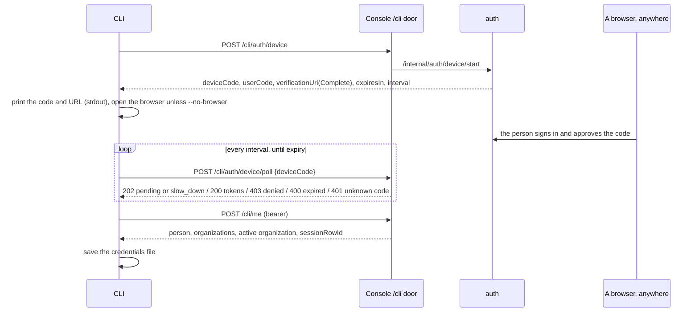

# Signing in

The CLI signs in two ways:
- **The device flow, interactive.** It runs through the platform's `/cli` door: the person approves a short code in any browser, on any machine.
- **An API key, for automation.** The key opens only the public `/v1` API.

Either way, what the CLI keeps is one credentials file. The platform owns the session: the CLI holds the platform's opaque tokens, and the platform decides whether they still work.

The platform's code is the contract (AGENTS.md):
- the `/cli` door, `web/app/cli/[...path]/route.ts`;
- `/me`, `crates/auth/src/handler/me.rs`;
- the device grant, `crates/auth/src/issuer.rs` and `crates/auth/src/handler/session.rs`;
- the revoke, `crates/auth/src/handler/sessions.rs`;
- `/v1`, `crates/auth/src/handler/v1.rs`.

The platform's own side is in `telmoni/telmoni`'s `docs/identity.md`. A disagreement is reported there, not worked around here.

## Contents

- [The device flow](#the-device-flow)
- [The credentials file](#the-credentials-file)
- [Refresh](#refresh)
- [When the session has ended](#when-the-session-has-ended)
- [Signing out](#signing-out)
- [API keys](#api-keys)
- [Where it disagrees with the platform](#where-it-disagrees-with-the-platform)
- [Where it lives](#where-it-lives)

## The device flow

1. **Start.** `POST /cli/auth/device`, with no bearer and no body (`src/auth/device.rs`). The platform answers:
   - a device code, kept secret and never printed;
   - a short user code, shown as `XXXX-XXXX`;
   - the console's `/auth/device` page, as a plain URL and as one carrying the code;
   - the code's lifetime and the polling interval.
2. **Show it.** The user code and the plain URL go to stdout. The CLI tries to open the URL carrying the code in a browser (the plain URL, if the platform sent no such one), unless `--no-browser` is given. A failure there is a note on stderr, never an error.
   - ⚠ **It opens the URL only on the endpoint's own origin** (`same_origin`: scheme, host and port). The answer is the server's, and one naming another host or scheme would hand the one-time code, and the machine's URL handler, to whatever it named. Such a URL is left to the person, with a note; it is printed above either way.
   - ⚠ **Nothing depends on the browser reaching this machine.** The CLI runs over SSH, in containers and on hosts with no browser. That is why it uses the device flow and not a loopback redirect. There is no listener and no PKCE (AGENTS.md).
3. **Poll** (`poll_until_granted`). Each round sleeps first, then checks the code's lifetime on the local clock, then polls:

   | The platform answers | The CLI |
   |---|---|
   | 202, pending | Waits another interval |
   | 202, `slow_down` | Adds 5 s to the interval, for the rest of this login |
   | 429 | Waits the problem's `retry_after_secs` once, or the interval if that is longer, then carries on |
   | 200 | Has its tokens |
   | 403 | Stops: the sign-in was denied in the console |
   | 400 | Stops: the code expired before it was approved |
   | 401, `invalid-token` | Stops: the device code is no longer valid (unknown, or already granted, denied, expired or swept) |
   | Any other 401 | Stops, with the platform's own words: it is not about the code |
   | 5xx, or a network failure | Stops. The person runs `telmoni login` again. |

   The interval never drops below one second.
4. **Who am I.** `POST /cli/me` with the new bearer. The door sends `/me` the CLI's `User-Agent`, so the session appears under Active sessions on the person's Privacy page as "Telmoni CLI (macOS)" or similar. `/me` writes the session row, and answers its id (`sessionRowId`), which later sign-outs need.
5. **Save** the credentials file, then print who signed in and their active organization.

Signing in again overwrites the file without revoking the earlier session, which stays under Active sessions until it ends there.

## The credentials file

`dirs::config_dir()/telmoni/credentials.json`: `~/Library/Application Support/telmoni/` on macOS, `~/.config/telmoni/` on Linux. It is mode `0600` and **not encrypted**. It is plain JSON (`src/auth/storage.rs`), holding:
- `auth_type`: `device` or `api_key`;
- `endpoint`: the base URL, fixed at sign-in;
- for the device flow: the access and refresh tokens, `expires_at` (on the local clock), `session_row_id`, the person, the cached organizations (id, slug, label, role), and the active organization's id;
- for an API key: the key;
- `updated_at`.

**Reading it.** A missing file reads as signed out, silently. A file that is there but cannot be read or parsed also reads as signed out, with a note on stderr saying to sign in again; so does one missing what its kind needs (a device sign-in with no token, an API key sign-in with no key). Nothing else is said of the file: no "corrupt", and never its contents. There is no migration of an older shape (AGENTS.md): a file written before a field became required, such as `slug`, is one of these, and `logout` deletes it without a revoke, since nothing in it can be used.

**Writing it is atomic** (`save`):
1. Write to a sibling temporary file, opened `create_new` with mode `0600`.
2. Flush it to disk.
3. Rename it over the old file.
4. Flush the directory, because a rename is durable only once its directory entry is.

⚠ Why it is built this way:
- **Tokens never sit in a readable file**, even for a moment.
- **A crash leaves the previous file whole**, never a torn one that reads as signed out.
- **The rename replaces any looser mode** an older file had.

Directories get `0700` only when the CLI creates them; an existing directory is not this code's to tighten. There is no lock between two CLI processes writing at once; the last rename wins.

**When it is written:**
- at sign-in;
- after every refresh;
- by `status`, which refreshes the cached person and organizations;
- by `org switch`, once `/cli/me` has answered, whether or not the switch then goes through (see [commands](commands.md#organizations)).

## Refresh

The access token is short-lived. The CLI refreshes:
- **ahead of time**, before `status` and `org switch` when the token expires within 60 seconds or its expiry is unknown (`refresh_if_needed`), and before `logout` when it expires within 60 seconds;
- **after the fact**, once, when `/cli/me` or the revoke answers a 401 typed `token-expired`, or `invalid-token`. It refreshes and retries the call once, and the refresh's own answer decides whether the session lives.
  - ⚠ **Why `invalid-token` too.** The platform answers `token-expired` only while the expired bearer's row exists. Its retention sweep deletes expired rows (daily, per replica), and the same bearer then reads as unknown. A clock that runs slow here skips the early refresh and meets exactly that, and taking it as the end would delete a session that one refresh saves.

The request is `POST /cli/auth/refresh` with `{ refreshToken, sessionRowId }`. `sessionRowId` is left out when unknown, never sent as null. The door converts the body to the platform's snake case.

The answer replaces the access token, its expiry and the refresh token. ⚠ The platform rotates the refresh token on every use. A spent one presented again after a short grace ends the whole session, so the new refresh token must reach the file, and an answer that carries none leaves none stored — the next refresh then signs the CLI out (the table below). The CLI saves it, and a failed save is an error.

⚠ **A refresh that got no answer to read is asked for again at once**, with the same token: a 5xx, a dropped connection, a timeout. The platform may have spent the token before the answer was lost; the door gives up on auth after 10 s and answers a `503` of its own. Within the platform's grace (`REUSE_GRACE_SECS`, 30 s) the spent token earns the next pair; presented later, by the next command, it would end the session. One retry, never more, and an answer that refuses, such as a `429` or a `401`, is not asked again.

## When the session has ended

A 401 is read by its problem type (`device.rs`, `refused_credentials`), not its status alone:

| Answer | The credentials file |
|---|---|
| A 401 typed `unauthenticated` on `/cli/me`: the session was revoked, or the account is being deleted | **Deleted**, then "session ended; run `telmoni login`". No retry. |
| A 401 typed `invalid-token` or `unauthenticated` on the refresh: the refresh token is unknown, spent, past its lifetime, or gone with its session | **Deleted**, as above |
| A 401 typed `token-expired` or `invalid-token` on `/cli/me` | Kept for one refresh, which decides. A 401 of these three types on the retry is final. |
| A refresh needed, but no refresh token held | Deleted |
| ⚠ Any other 401, of another type or none | **Kept**, and its message shown. It is not auth judging this session: the door answers its own hop failing as a `503`, auth refusing the console's service secret (a botched `SERVICE_SECRET` rotation) included, and a 401 of another shape comes from whatever sits in front of the platform. Taken as the end, one would sign out every CLI that met it. |
| A 5xx, a 400/403/404/429, a network failure, a body that does not decode | **Kept.** ⚠ A 5xx or a dropped connection says nothing about whether the session is still live. |
| Any error on `/v1`, under an API key | Kept |

Ending a session under Active sessions in the console therefore signs the CLI out on its next request.

## Signing out

`telmoni logout` (`src/commands/logout.rs`):

1. **An API key, or a file that can't be read:** delete the file. There is nothing on the server to end.
2. **Choose the organization header.** The revoke lane is audited on an organization, and the platform requires the header from anyone who belongs to one. The CLI uses `TELMONI_ORG`, else the stored active organization, else the first stored one. The variable names one by id or slug, and the header carries its id. If it names an organization not in the cache, it stops here, and keeps the file.
3. **Refresh first**, if the token expires within 60 seconds and a refresh token is held. A refresh refused as over means the session already ended: no revoke, no note. Any other failure leaves the old bearer to try, since it may still be inside the platform's leeway.
4. **Revoke.** `POST /cli/sessions/{sessionRowId}/revoke`. A 204 is success, and so is a 404 typed `/errors/auth/not-found`, auth's "session not found": already gone.
   - ⚠ **Only that 404.** The door answers a path no lane matches, a session id that is not a UUID among them, with a 404 of its own, before any hop, and that leaves the session as live as it was.
5. **On a 403**, the cached organization is one the person has left: the CLI sends the revoke again naming none, which the platform takes from somebody in no organization. **On a 400**, from either attempt, they belong to one the header did not name: the CLI asks `/cli/me` without a header and sends the revoke naming the organization it answers.
   - ⚠ **Never `/me` first.** It makes an organization for somebody in none, so asked before the revoke naming none, signing out would found one.
6. **On a 401 typed `token-expired` or `invalid-token`**, when step 3 did not refresh and a refresh token is held: one refresh, then the revoke again, with step 5's fallback. A clock that runs slow here is what skips step 3 (see [refresh](#refresh)). A refresh refused as over means the session already ended.
7. **What counts as ended.** A revoke refused as `unauthenticated`, or refused as expired or unknown again after a refresh, had already ended. Anything else is unconfirmed: a 401 of another type, any other status (the door's `503` among them), a network failure, a bearer refused as expired with no refresh token to renew it, a session id never saved.
8. **Delete the file, whatever the answer.** If the server did not confirm, a note on stderr says to end the session under Active sessions in the console.

`end_session` makes the decision and `execute` prints it, so the tests read every outcome without capturing stderr.

The door has no sign-out lane of its own, so the CLI signs out through the same revoke Active sessions uses. That lane revokes any one of the person's own sessions, so a CLI's bearer could end a browser session too.

## API keys

`telmoni login --key telmoni_…`, or the `TELMONI_API_KEY` variable at login:
- **Checking it.** The key must start with `telmoni_`, have something after it, and contain no whitespace. Nothing calls the platform to check it.
- **Storing it.** It is kept in the credentials file as `api_key`, with the endpoint. `TELMONI_API_KEY` is read only by `login`, not by later commands.
- **Using it.** It opens only `{endpoint}/v1` reads, never `/cli` (AGENTS.md). Today only `status` uses it, through `GET /v1/organization` (see [transport](transport.md#the-v1-client)).

An API key is an organization's key, minted on one of its projects in the console. The platform checks it on every request: it must be live, its organization active, and the public API switched on for that organization.

## Where it disagrees with the platform

These are differences between the CLI's code and the platform's, found by reading both. None has been seen to fail on a live tier.

| Here | The platform | Effect |
|---|---|---|
| `slow_down` adds 5 s for good, as RFC 8628 has it | The interval never grows: a poll is held to the interval the start answered (its `identity.md` says so) | Harmless: the CLI just polls more slowly |
| A slug is matched exactly | The console redirects a slug typed with a capital to the slug | `org switch Acme` is unknown; `acme` is the slug. Deliberate: a slug is lowercase, and loosening the match is a step towards the name, which is not a name here |

The door no longer relays auth refusing its own service secret as a `401` (it answers `503`), and its own `404`, for a path no lane matches, is typed `/errors/not-found`; the CLI reads both by type either way.

## Where it lives

| Concern | File |
|---|---|
| Device flow, refresh, the 401 rules | `src/auth/device.rs` |
| Credentials file, atomic save | `src/auth/storage.rs` |
| `login`, `logout` | `src/commands/login.rs`, `src/commands/logout.rs` |
| `/v1` client | `src/client.rs` |
| Tests | `tests/auth_tests.rs`, `tests/cli_tests.rs` |
